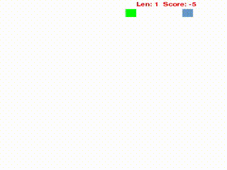
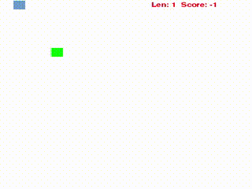

# Nagging-Naagin: Deep Q-Learning Applied to Snake

Using adverserial search, reinforcement learning and eventually deep-q learning for model independent game play of snake. The game has been built uisng `pygame` and various agents have been provided that can be used to play the game.

## Preview

Properties|Reflex | MinMax|
|----------|-------------|-------------|
|Preview    |||
|Grid Size| 20x20 | 20x20|
SnakeAgent| Reflex| MinMax|
Food Agent| MaxManhattanFood|MaxManhattanFood|
Mean Score| 1645.450|1857.575|
Mean Snake Length | 59.125| 47.400|
Time-Real (40 runs)| 1m14.105s | (approx)\* 4 Hour|
Time-User (40 runs)| 0m6.547s | (approx)\* 4 Hour|
Time-System (40 runs)| 0m0.980s | (approx)\* 4 Hour|
Misc| None|  Depth=6

\* *The latest implementation using a lazy-evaluation technique has brought this down to 40 minutes. New data coming up soon!*


## Installation
>The module uses `python3` and has `Keras` with `Theano` backend installed from their upstream git repository as the pip package was not up-to-date. If you face problems with Keras during the installation procedure, revert back to the version specified in the `requirements.txt`. 

Create a `virtualenv` with `python3` and install `Keras` with `Theano` backend. Then install the requirements specified in the `requirements.txt` using pip:

    pip install -r requirements.txt

There is no documentation yet within the code, but it should be easy to follow. For a GUI version of the game simulation, run the following from the project root:

    python -m dlsnake.snakeGame

Various agents have been included and can be enabled using the `--agent` flag.

## Usage
```
usage: snakeGame.py [-h] [-a {ReflexAgent,MinMaxAgent}]
                    [-s {RandomFoodAgent,MaxManhattanFoodAgent}] [-n] [-t]
                    [-f FRAMERATE] [-z] [-c] [-d DEPTH]

Naagin-Nagging v0.1 - Applying Deep Q-Learning to Snake.

optional arguments:
  -h, --help            show this help message and exit
  -a {ReflexAgent,MinMaxAgent}, --agent {ReflexAgent,MinMaxAgent}
                        Specify the agent to use for playing snake.
  -s {RandomFoodAgent,MaxManhattanFoodAgent}, --food-agent {RandomFoodAgent,MaxManhattanFoodAgent}
                        Specify the food agent to use.
  -n, --no-graphics     Disable graphics and run silently.
  -t, --text-graphics   Enable text graphics.
  -f FRAMERATE, --frame-rate FRAMERATE
                        Frame rate for GUI graphics. Should be a non - zero
                        integer.
  -z, --silent          Silently execute, no output to console and no
                        graphics.
  -c, --csv             Prints (score, length) csv value. Can be used along
                        with the --silent flag.
  -d DEPTH, --depth DEPTH
                        Depth for searching. Only valid for MinMaxAgent.

```