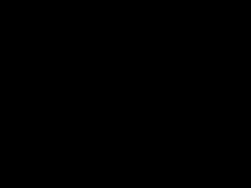
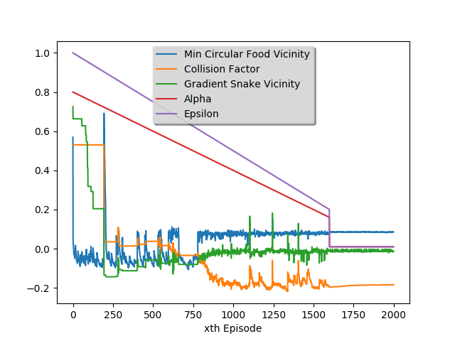
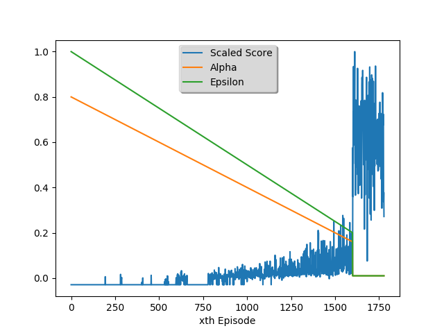

# Nagging-Naagin: Deep Q-Learning Applied to Snake

Using adverserial search, reinforcement learning and eventually deep-q learning for model independent game play of snake. The game has been built uisng `pygame` and various agents have been provided that can be used to play the game.

## Preview

Properties|Reflex | MinMax| Approx Q-Learning|
|----------|-------------|-------------|----------|
|Preview    ||||
|Grid Size| 20x20 | 20x20| 20x20|
SnakeAgent| Reflex| MinMax| ApproxQLearning|
Food Agent| MaxManhattanFood|MaxManhattanFood| RandomFoodAgent|
Mean Score| 1645.450|1857.575| 2177.14|
Mean Snake Length | 59.125| 47.400| 65.03
Time-Real | 1m14.105s (40 runs) | 40m (40 runs)| 10m21.371s (2000 episodes)
Time-User | 0m6.547s  (40 runs)| 40m (40 runs)| 10m21.163s (2000 episodes)
Time-System | 0m0.980s  (40 runs)| 0m (40 runs)|0m0.457s (2000 episodes)
Misc| None|  Depth=6| FeatureExtractor: simpleFeatureExtractor4|


The following table shows some more analysis on the training data.

|Weight Convergence| Scaled Score |
|------------------|-------------|
||
## Installation
>The module uses `python3` and has `Keras` with `Theano` backend installed from their upstream git repository as the pip package was not up-to-date. If you face problems with Keras during the installation procedure, revert back to the version specified in the `requirements.txt`. 

Create a `virtualenv` with `python3` and install `Keras` with `Theano` backend. Then install the requirements specified in the `requirements.txt` using pip:

    pip install -r requirements.txt

There is no documentation yet within the code, but it should be easy to follow. For a GUI version of the game simulation, run the following from the project root:

    python -m dlsnake.snakeGame

Various agents have been included and can be enabled using the `--agent` flag.

## Usage
```
usage: snakeGame.py [-h] [-a {ReflexAgent,MinMaxAgent}]
                    [-s {RandomFoodAgent,MaxManhattanFoodAgent}] [-n] [-t]
                    [-f FRAMERATE] [-z] [-m SIMULATE] [-y NUM_THREADS]
                    [-d DEPTH] [-c]

Naagin-Nagging v0.1 - Applying Deep Q-Learning to Snake.

optional arguments:
  -h, --help            show this help message and exit
  -a {ReflexAgent,MinMaxAgent}, --agent {ReflexAgent,MinMaxAgent}
                        Specify the agent to use for playing snake.
  -s {RandomFoodAgent,MaxManhattanFoodAgent}, --food-agent {RandomFoodAgent,MaxManhattanFoodAgent}
                        Specify the food agent to use.
  -n, --no-graphics     Disable graphics and run silently.
  -t, --text-graphics   Enable text graphics.
  -f FRAMERATE, --frame-rate FRAMERATE
                        Frame rate for GUI graphics. Should be a non - zero
                        integer.
  -z, --silent          Silently execute, no output to console and no
                        graphics.
  -m SIMULATE, --simulate SIMULATE
                        Run specified number of simulations on each thread and
                        echo output (length, score) to console. Can be multi-
                        threaded using --thread
  -y NUM_THREADS, --num-threads NUM_THREADS
                        Specify the number of threads to use when in
                        simulation mode.
  -d DEPTH, --depth DEPTH
                        Depth for searching. Only valid for MinMaxAgent.
  -c, --csv             Echo output in CSV format (length, score).

```

## Relevant Material 
  - [Dynamic Programming and Reinforcement Learning](http://research.cs.rutgers.edu/~thomaswa/pub/Geramifard13Tutorial.pdf)
  - [Going Deeper Into Reinforcement Learning: Understanding Q-Learning and Linear Function Approximation](https://danieltakeshi.github.io/2016/10/31/going-deeper-into-reinforcement-learning-understanding-q-learning-and-linear-function-approximation/)
  - [Q-learning with linear function approximation](https://pdfs.semanticscholar.org/e0ea/3bae8168d74b0256882926bcb38f2252ab63.pdf)